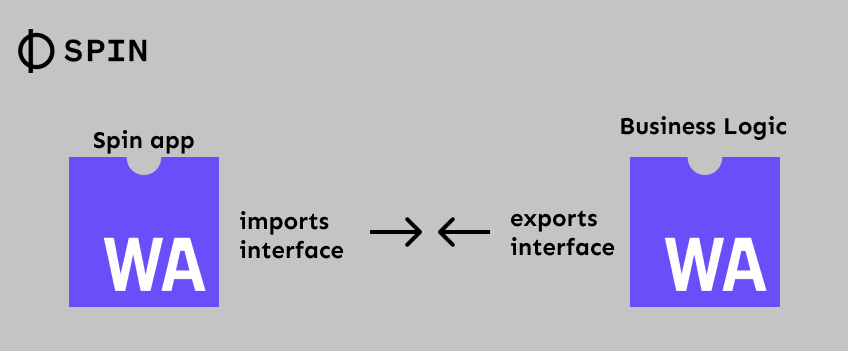

## Example 1: Importing functionality from a WASM component in a Spin component

In this example a Spin component (a wasi-http component using the Spin SDK) imports a function from a WASM component to handle some business logic. The intention with the example is to show how the Spin component can wrap the concern of the transport protocol (HTTP) and pass on only the payload to another component, which then implements the business logic.



The [WASM component (business-logic)](./business-logic/) implements the interface defined in it's [wit file](./business-logic/wit/world.wit):

```wit
interface data-handler {
  // The function to pass on the my-object to.
  handle-data: func(key: my-object) -> my-object;

  // The my-object record, aka. the object to pass between the two components.
  record my-object {
    name: string,
    steps: u32,
    processed: option<bool>,
  }
}
```

The interface includes a function, which takes an argument of the record (type) `my-object`, and returns the same record (type).

The Spin application using the component is importing the component using Spin's component dependency feature. To make the workflow really easy, the [Spin Dependency Plugin](https://github.com/fermyon/spin-deps-plugin) can be used to help wire everything up.

### How to build

1. Start by building the business-logic component, by running `cargo component build --target wasm32-unknown-unknown`. We'll use the general wasm32 target, as the component doesn't need any of the WASI APIs available in the default target (`wasm32-wasip1`).

1. You can check the component's exports by running `wasm-tools component wit target/wasm32-unknown-unknown/debug/businesslogic.wasm`

1. Next up we need to import the component in our Spin application. You can start from scratch by creating a new Spin application, using a Rust template - e.g., `spin new -t http-rust`. Note: Currently the Spin Dependency Plugin only supports generating bindings in Rust, if you want to use another language, you'll have to use other tools to generate bindings. Take a look here for more information: https://component-model.bytecodealliance.org/language-support.html.

1. Now in the directory of the newly created Spin application, let's add the `business-logic` dependency to our Spin component: `spin deps add ../business-logic/target/wasm32-unknown-unknown/debug/businesslogic.wasm`. This will prompt a few questions about which component to add the dependency to, which wit package to use and which interfaces to import. This is a set of select boxes, so you'll be guided through this nicely. The result is that the dependency is added to the `spin.toml` file, like in this [example](spin-app-dependencies/spin.toml). Note: that it is also supported to refer to dependencies in a registry - check `spin deps add --help`.

1. Next thing we want to generate the bindings, so we can use the component. `spin deps generate-bindings --language rust --output src/bindings --component-id my_component`. This will put the bindings in the specified output directory.

1. Now we can simply start using the interface implemented in the `business-logic` component. Check out the sample [here](spin-app-dependencies/src/lib.rs) for how to do this.

1. Finally to build the application, just use the regular `spin build` and then `spin up` the app and try it out.
